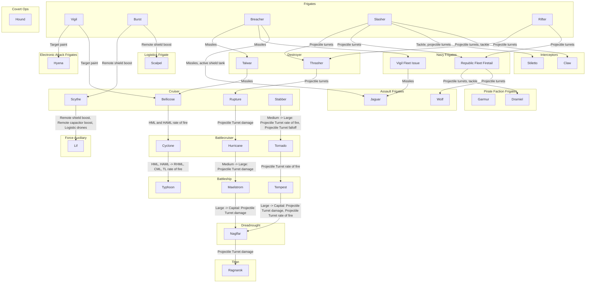

# EveShipsProgression

```mermaid
flowchart
	subgraph s1["Frigates"]
		n21["Vigil"]
		n17["Burst"]
		n10["Breacher"]
		n5["Slasher"]
		n1["Rifter"]
	end
	n1
	subgraph s2["Cruiser"]
		n18["Scythe"]
		n12["Bellicose"]
		n7["Rupture"]
		n2["Stabber"]
	end
	n1
	n2
	subgraph s3["Battlecruiser"]
		n13["Cyclone"]
		n8["Hurricane"]
		n3["Tornado"]
	end
	n2 -->|"Medium -> Large: Projectile Turret rate of fire, Projectile Turret falloff"| n3
	subgraph s4["Battleship"]
		n14["Typhoon"]
		n9["Maelstrom"]
		n4["Tempest"]
	end
	n3 -->|"Projectile Turret rate of fire"| n4
	subgraph s5["Destroyer"]
		n11["Talwar"]
		n6["Thrasher"]
	end
	n5 -->|"Projectile turrets"| n6
	n6 -->|"Projectile turrets"| n7
	n7 -->|"Projectile Turret damage"| n8
	n8 -->|"Medium -> Large: Projectile Turret damage"| n9
	n10 -->|"Missiles"| n11
	n11 -->|"Missiles"| n12
	n12 -->|"HML and HAML rate of fire"| n13
	n13 -->|" HML, HAML -> RHML, CML, TL rate of fire"| n14
	subgraph s6["Dreadnought"]
		n15["Naglfar"]
	end
	n4 -->|"Large -> Capital: Projectile Turret damage, Projectile Turret rate of fire"| n15
	n9 -->|"Large -> Capital: Projectile Turret damage"| n15
	subgraph s7["Titan"]
		n16["Ragnarok"]
	end
	n15 -->|"Projectile Turret damage"| n16
	n17 -->|"Remote shield boost"| n18
	subgraph s8["Force Auxiliary"]
		n19["Lif"]
	end
	n18 -->|"Remote shield boost, Remote capacitor boost, Logistic drones"| n19
	subgraph s9["Logistics Frigate"]
		n20["Scalpel"]
	end
	n1 -->|"Projectile turrets"| n6
	subgraph s10["Navy Frigates"]
		n29["Vigil Fleet Issue"]
		n22["Republic Fleet Firetail"]
	end
	n5 -->|"Projectile turrets"| n22
	n1 -->|"Projectile turrets"| n22
	subgraph s11["Interceptors"]
		n24["Claw"]
		n23["Stiletto"]
	end
	n5 -->|"Tackle, projectile turrets"| n23
	n5 -->|"Projectile turrets, tackle"| n24
	subgraph s12["Pirate Faction Frigates"]
		n31["Garmur"]
		n25["Dramiel"]
	end
	n22 -->|"Projectile turrets, tackle"| n25
	subgraph s13["Assault Frigates"]
		n30["Jaguar"]
		n26["Wolf"]
	end
	n1
	n26
	n22 -->|"Projectile turrets"| n26
	subgraph s14["Covert Ops"]
		n27["Hound"]
	end
	n10
	n27
	n17 -->|"Remote shield boost"| n20
	subgraph s15["Electronic Attack Frigates"]
		n28["Hyena"]
	end
	n21 -->|"Target paint"| n28
	n21 -->|"Target paint"| n12
	n10 -->|"Missiles"| n29
	n10
	n30
	n29 -->|"Missiles"| n30
	n10 -->|"Missiles, active shield tank"| n30
	n31
```
