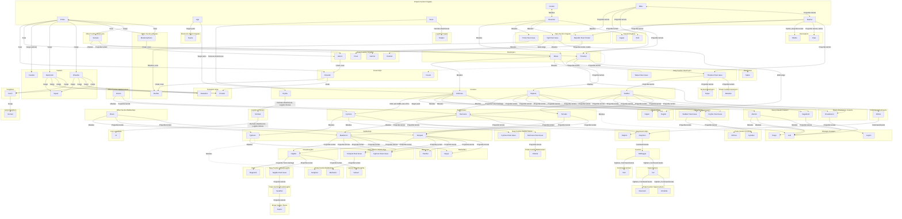

# EveShipsProgression

```mermaid
flowchart
	subgraph s1["Empire Faction Frigates"]
		n89["Condor"]
		n33["Probe"]
		n21["Vigil"]
		n17["Burst"]
		n10["Breacher"]
		n5["Slasher"]
		n1["Rifter"]
	end
	subgraph s2["Cruisers"]
		n18["Scythe"]
		n12["Bellicose"]
		n7["Rupture"]
		n2["Stabber"]
	end
	subgraph s3["Battlecruiser"]
		
		n13["Cyclone"]
		n8["Hurricane"]
		n3["Tornado"]
	end
	n2 -->|"Projectile turrets"| n3
	subgraph s4["Battleships"]
		n14["Typhoon"]
		n9["Maelstrom"]
		n4["Tempest"]
	end
	n3 -->|"Projectile turrets"| n4
	subgraph s5["Destroyers"]
		n11["Talwar"]
		n6["Thrasher"]
	end
	n5 -->|"Projectile turrets"| n6
	n6 -->|"Projectile turrets"| n7
	n7 -->|"Projectile Turret damage"| n8
	n8 -->|"Projectile turrets"| n9
	n10 -->|"Missiles"| n11
	n11 -->|"Missiles"| n12
	n12 -->|"HML and HAML rate of fire"| n13
	n13 -->|"Missiles"| n14
	subgraph s6["Dreadnoughts"]
		n15["Naglfar"]
	end
	n4 -->|"Projectile turrets"| n15
	n9 -->|"Projectile turrets"| n15
	subgraph s7["Titan"]
		n16["Ragnarok"]
	end
	n15 -->|"Projectile Turret damage"| n16
	n17 -->|"Remote shield boost"| n18
	subgraph s8["Force Auxiliary"]
		n19["Lif"]
	end
	subgraph s9["Logistics Frigate"]
		n20["Scalpel"]
	end
	subgraph s10["Navy Faction Frigates"]
		n32["Probe Fleet Issue"]
		n29["Vigil Fleet Issue"]
		n22["Republic Fleet Firetail"]
	end
	n5 -->|"Projectile turrets"| n22
	n1 -->|"Projectile turrets"| n22
	subgraph s11["Interceptors"]
		n24["Claw"]
		n23["Stiletto"]
	end
	n5 -->|"Tackle, projectile turrets"| n23
	n5 -->|"Projectile turrets, tackle"| n24
	subgraph s12["Pirate Faction Frigates"]
		n40["Cruor"]
		n34["Astero"]
		n31["Garmur"]
		n25["Dramiel"]
	end
	n22 -->|"Projectile turrets, tackle"| n25
	subgraph s13["Assault Frigates"]
		n30["Jaguar"]
		n26["Wolf"]
	end
	subgraph s14["Covert Ops"]
		n41["Hound"]
		n27["Cheetah"]
	end
	n17 -->|"Remote shield boost"| n20
	subgraph s15["Electronic Attack Frigates"]
		n28["Hyena"]
	end
	n21 -->|"Target paint"| n28
	n21 -->|"Target paint"| n12
	n10 -->|"Missiles"| n32
	n10 -->|"Missiles"| n29
	n33 -->|"Scan"| n27
	n33 -->|"Scan"| n34
	subgraph s16["Haulers"]
		n62["Squall"]
		n37["Mammoth"]
		n36["Wreathe"]
		n35["Hoarder"]
	end
	n33 -->|"Cargo (ammo)"| n35
	n33 -->|"Cargo"| n37
	n33 -->|"Cargo"| n36
	subgraph s17["Other Faction Frigates"]
		n39["Pacifier"]
		n38["Metamorphosis"]
	end
	n38 -->|"Scan"| n33
	n33 -->|"Scan"| n38
	n38 -->|"Cloak, scan"| n34
	n34 -->|"Cloak, scan"| n27
	n27 -->|"Cloak, scan"| n39
	n32 -->|"Missiles, scan"| n39
	n29 -->|"Web range"| n40
	subgraph s18["Navy Faction Destroyers"]
		n47["Talwar Fleet Issue"]
		n42["Thrasher Fleet Issue"]
	end
	n1 -->|"Projectile turrets"| n6
	n5 -->|"Projectile turrets"| n42
	n6 -->|"Projectile turrets"| n42
	n42 -->|"Projectile turrets"| n2
	subgraph s19["Interdictors"]
		n43["Sabre"]
	end
	n6 -->|"Projectile turrets"| n43
	subgraph s20["Tactical Destroyers"]
		n44["Svipul"]
	end
	n42 -->|"Projectile turrets"| n44
	subgraph s21["Pirate Faction Destroyers"]
		n45["Mekubal"]
	end
	n42 ---|"Projectile turrets"| n45
	subgraph s22["Other Faction Destroyers"]
		n46["Sunesis"]
	end
	n33 -->|"Cargo"| n46
	n11 ---|"Missiles"| n47
	subgraph s23["Command Destroyers"]
		n48["Bifrost"]
	end
	n11 -->|"Missiles"| n48
	n46 -->|"Missiles"| n11
	n46 -->|"Projectile turrets"| n6
	subgraph s24["Recon Ships"]
		n51["Rapier"]
		n49["Huginn"]
	end
	n12 -->|"Target paint"| n49
	n29 -.->|"Missiles"| n31
	n29 -->|"Web range"| n49
	n7 -->|"Projectile turrets"| n49
	n2 -->|"Projectile turrets"| n49
	subgraph s25["Navy Faction Cruisers"]
		n57["Stabber Fleet Issue"]
		n50["Scythe Fleet Issue"]
	end
	n12 -->|"Missiles"| n50
	n12 -->|"Missiles"| n51
	subgraph s26["Heavy Assault Cruisers"]
		n58["Vagabond"]
		n53["Muninn"]
	end
	n12 -->|"Missiles"| n53
	subgraph s27["Strategic Cruisers"]
		n56["Legion"]
		n55["Tengu"]
		n52["Loki"]
	end
	n53 -->|"Missiles"| n52
	subgraph s28["Pirate Faction Cruisers"]
		n60["Cynabal"]
		n54["Orthrus"]
	end
	n12 -.->|"Missiles"| n54
	n53 -->|"Missiles"| n55
	n53 -->|"Missiles"| n56
	n2 -->|"Projectile turrets"| n57
	n2 -->|"Projectile turrets"| n50
	n2 -->|"Projectile turrets"| n58
	subgraph s29["Heavy Interdiction Cruisers"]
		n59["Broadsword"]
	end
	n57 -->|"Projectile turrets"| n52
	n57 -->|"Projectile turrets"| n60
	n2 -->|"Projectile turrets"| n8
	n7 -->|"Projectile turrets"| n57
	n7 -->|"Projectile turrets"| n50
	n7 -->|"Projectile turrets"| n58
	n7 -->|"Projectile turrets"| n59
	n10 -.->|"Missiles"| n41
	n10 -->|"Missiles"| n30
	n1 -->|"Projectile turrets"| n26
	n2 -->|"Projectile turrets"| n59
	n58 -->|"Projectile turrets"| n52
	n59 -->|"Projectile turrets"| n52
	subgraph s30["Logistics Cruisers"]
		n61["Scimitar"]
	end
	n18 -->|"Remote shield boost, Logistic drones"| n61
	n61 -->|"Remote shield boost, Logistic drones"| n19
	n35
	n62
	n37 -->|"Cargo"| n62
	n36 -->|"Cargo"| n62
	subgraph s31["Navy Faction Battlecruisers"]
		n66["Hurricane Fleet Issue"]
		n63["Cyclone Fleet Issue"]
	end
	n13 -->|"Missiles"| n63
	subgraph s32["Command ships"]
		n67["Sleipnir"]
		n64["Claymore"]
	end
	n13 -->|"Missiles"| n64
	subgraph s33["Other Faction Battlecruisers"]
		n65["Gnosis"]
	end
	n65 -->|"Missiles"| n13
	n8 -->|"Projectile turrets"| n66
	n8 -->|"Projectile turrets"| n67
	subgraph s34["Pirate Faction Battlcruisers"]
		n68["Khizriel"]
	end
	n66 -->|"Projectile turrets"| n68
	n65 -->|"Projectile turrets"| n8
	n8 -->|"Projectile turrets"| n4
	n3 -->|"Projectile turrets"| n9
	subgraph s35["Navy Faction Battleships"]
		n70["Tempest Fleet Issue"]
		n69["Typhoon Fleet Issue"]
	end
	n14 -->|"Missiles"| n69
	n4 -->|"Projectile turrets"| n70
	n4 -->|"Projectile turrets"| n69
	subgraph s36["Black Ops"]
		n71["Panther"]
	end
	n4 -->|"Projectile turrets"| n71
	subgraph s37["Marauders"]
		n72["Vargur"]
	end
	n4 -->|"Projectile turrets"| n72
	subgraph s38["Pirate Faction Battleships"]
		n74["Machariel"]
		n73["Barghest"]
	end
	n14 -.->|"Missiles"| n73
	n9 -->|"Projectile turrets"| n70
	n9 -->|"Projectile turrets"| n69
	n9 -->|"Projectile turrets"| n71
	n9 -->|"Projectile turrets"| n72
	n70 -->|"Projectile turrets"| n74
	subgraph s39["Other Faction Battleships"]
		n75["Praxis"]
	end
	n75 -->|"Missiles"| n14
	n75 -->|"Projectile turrets"| n9
	n75 -->|"Projectile turrets"| n4
	subgraph s40["Navy Faction Dreadnoughts"]
		n76["Naglfar Fleet Issue"]
	end
	n15 -->|"Projectile turrets"| n76
	subgraph s41["Lancer Dreadnoughts"]
		n77["Valravn"]
	end
	n15 -->|"Projectile turrets"| n77
	subgraph s42["Pirate Faction Dreadnoughts"]
		n78["Sarathiel"]
	end
	n76 -->|"Projectile turrets"| n78
	subgraph s43["Pirate Faction Titans"]
		n79["Azariel"]
	end
	n78 -->|"Projectile turrets"| n79
	subgraph s44["Carriers"]
		n80["Nidhoggur"]
	end
	n48 -->|"Command bursts"| n64
	n64 -->|"Command bursts"| n80
	subgraph s45["Command carriers"]
		n81["Ymir"]
	end
	n80 -->|"Fighters, Command bursts"| n81
	subgraph s46["Supercarriers"]
		n82["Hel"]
	end
	n80 -->|"Fighters, Command bursts"| n82
	subgraph s47["Pirate Faction Supercarriers"]
		n84["Vendetta"]
		n83["Revenant"]
	end
	n82 -->|"Fighters, Command bursts"| n83
	n82 ---|"Fighters, Command bursts"| n84
	subgraph s48["Transport ships"]
		n86["Mastodon"]
		n85["Prowler"]
	end
	n37 -->|"Cargo"| n85
	n36 -->|"Cargo"| n85
	n27 -->|"Cloak"| n85
	n37 -->|"Cargo"| n86
	n36 -->|"Cargo"| n86
	subgraph s49["Freighters"]
		n87["Fenrir"]
	end
	n37 -->|"Cargo"| n87
	n36 -->|"Cargo"| n87
	subgraph s50["Jump Freighters"]
		n88["Nomad"]
	end
	n87 -->|"Cargo"| n88
	n1 <-->|"Projectile turrets"| n5
	n89 <-->|"Missiles"| n10
```
