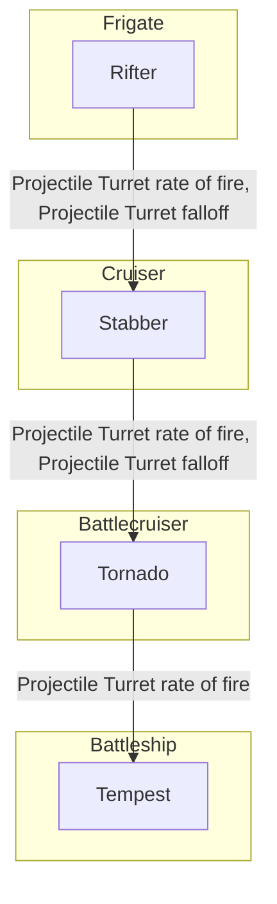

# EveShipsProgression

```mermaid
flowchart
	
	
	
	subgraph s1["Frigate"]
		n1["Rifter"]
	end
	n1
	subgraph s2["Cruiser"]
		n2["Stabber"]
	end
	n1 -->|"Projectile Turret rate of fire, Projectile Turret falloff"| n2
	subgraph s3["Battlecruiser"]
		n3["Tornado"]
	end
	n2 -->|"Projectile Turret rate of fire, Projectile Turret falloff"| n3
	subgraph s4["Battleship"]
		n4["Tempest"]
	end
	n3 -->|"Projectile Turret rate of fire"| n4
```
