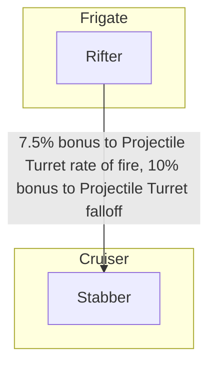

# EveShipsProgression

```mermaid
flowchart
	
	
	
	subgraph s1["Frigate"]
		n1["Rifter"]
	end
	n1
	subgraph s2["Cruiser"]
		n2["Stabber"]
	end
	n1 -->|"7.5% bonus to Projectile Turret rate of fire, 10% bonus to Projectile Turret falloff"| n2
```
