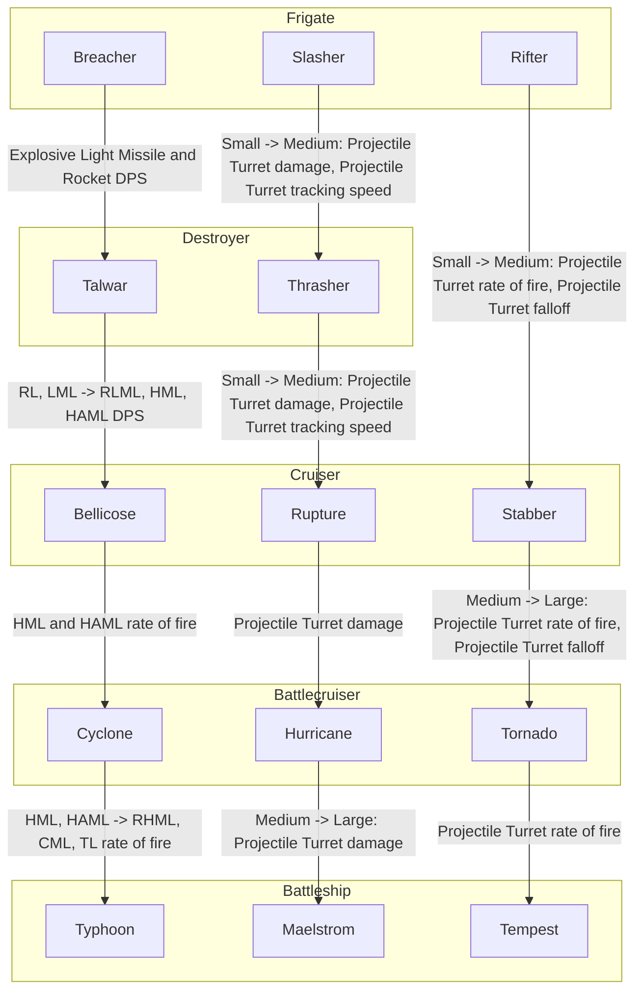

# EveShipsProgression

## Bonuses

```mermaid
flowchart
	
	
	
	subgraph s1["Frigate"]
		n10["Breacher"]
		n5["Slasher"]
		n1["Rifter"]
	end
	n1
	subgraph s2["Cruiser"]
		n12["Bellicose"]
		n7["Rupture"]
		n2["Stabber"]
	end
	n1 -->|"Small -> Medium: Projectile Turret rate of fire, Projectile Turret falloff"| n2
	subgraph s3["Battlecruiser"]
		n13["Cyclone"]
		n8["Hurricane"]
		n3["Tornado"]
	end
	n2 -->|"Medium -> Large: Projectile Turret rate of fire, Projectile Turret falloff"| n3
	subgraph s4["Battleship"]
		n14["Typhoon"]
		n9["Maelstrom"]
		n4["Tempest"]
	end
	n3 -->|"Projectile Turret rate of fire"| n4
	subgraph s5["Destroyer"]
		n11["Talwar"]
		n6["Thrasher"]
	end
	n5 -->|"Small -> Medium: Projectile Turret damage, Projectile Turret tracking speed"| n6
	n6 -->|"Small -> Medium: Projectile Turret damage, Projectile Turret tracking speed"| n7
	n7 -->|"Projectile Turret damage"| n8
	n8 -->|"Medium -> Large: Projectile Turret damage"| n9
	n10 -->|"Explosive Light Missile and Rocket DPS"| n11
	n11 -->|"RL, LML -> RLML, HML, HAML DPS"| n12
	n12 -->|"HML and HAML rate of fire"| n13
	n13 -->|" HML, HAML -> RHML, CML, TL rate of fire"| n14
```
